# W3 Evidence Pack: The Database Backbone

## 1. Cover

- **Group Name:** 13HZ
- **Members:**
  - Trần Phúc Tiến (Leader)
  - Nguyễn Ngọc Giao
  - Trần Quốc Kiệt
  - Bùi Thị Thùy Trang
  - Nguyễn Quách Khang Ninh
  - Võ Hồng Đức
  - Nguyễn Tấn Huy
- **Database Path Chosen:** DynamoDB / Key-Value Paradigm
- **Link to W2 Evidence:** [Chèn link tới file W2 evidence.md của bạn]
- **W2 Feedback Addressed:**
  - Đã khắc phục lỗi mở full quyền (wildcard) trong IAM role cho Lambda.
  - Triển khai VPC Gateway Endpoints để đảm bảo dữ liệu không đi qua Public Internet, tăng cường bảo mật tầng mạng.
    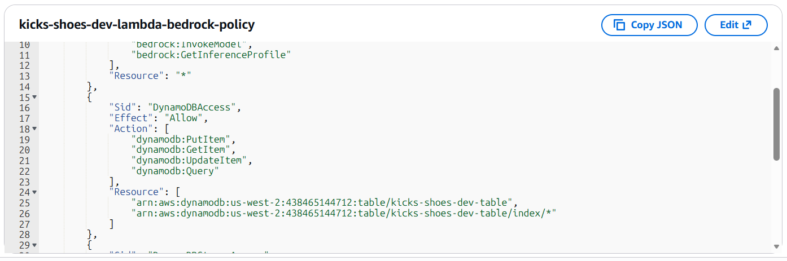

---

## 2. Data Access Pattern Log

### Part A: 3 Real Access Patterns

1. **Get Chat History:** Lấy lịch sử trò chuyện của một user cụ thể trong AI Chat, sắp xếp theo thời gian — ~50 calls/min.
2. **Get Product Details:** Truy xuất thông tin chi tiết của một đôi giày bằng Product ID — ~200 calls/min.
3. **List Active AI Conversations:** Truy xuất danh sách các phiên chat AI đang hoạt động của người dùng (dùng Global Secondary Index) — ~20 calls/min.

### Part B: Paradigm & Efficiency Justification

- **Engine + Paradigm:** DynamoDB (Key-Value)
- **Why it is efficient:** - **Pattern 1:** Dùng `Query` với Partition Key (PK) là `userId` và Sort Key (SK) là `timestamp` để lấy lịch sử theo thời gian thực mà không cần Scan toàn bảng.
  - **Pattern 2:** Cực kỳ phù hợp với Key-Value vì chỉ cần tra cứu trực tiếp theo PK là `productId`, đáp ứng độ trễ dưới 10ms.
  - **Pattern 3:** Sử dụng **Global Secondary Index (GSI)** để nhóm các cuộc hội thoại đang active, giúp tối ưu hóa việc tìm kiếm mà không tốn chi phí đọc (RCU) lớn.
- **Cost / Trade-off:** DynamoDB là dịch vụ Fully Managed, chi phí Pay-per-request (On-demand capacity) cực kỳ tối ưu cho startup, tự động Scale theo lượng truy cập mà không lo sập hệ thống.

### Part C: The "Wrong-Paradigm" Test

- **Tested Pattern:** Lấy lịch sử chat AI (10,000 tin nhắn/phút ở mức cao điểm).
- **Why Relational would fail:** Nếu dùng RDBMS (như RDS Postgres), với lượng write 10k/sec, hệ thống sẽ bị nghẽn ở Database Connection Pool. Bảng tin nhắn phình to đòi hỏi phải Sharding thủ công phức tạp. DynamoDB giải quyết việc này bằng thiết kế Key-Value tự động phân vùng (Auto Partitioning) vô hạn.

---

## 3. Deployment Evidence (DynamoDB)

### VPC Endpoint (Private Subnet Connectivity)

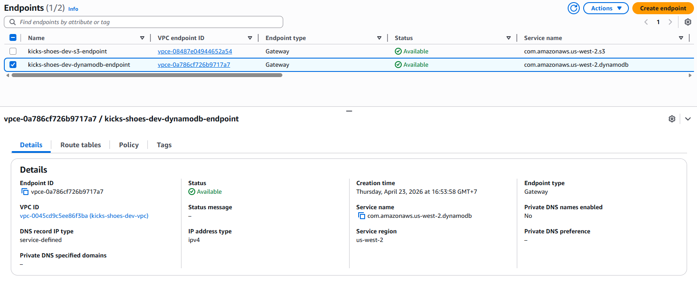

> _Note: Sử dụng Gateway Endpoint cho DynamoDB để đảm bảo traffic từ Private Subnet đi thẳng đến database qua mạng nội bộ AWS, không thông qua Internet._

### Encryption at Rest & Table Summary

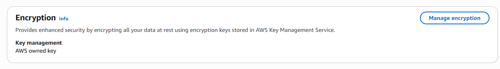

> _Note: Bảng `kicks-shoes-dev-table` được bật mã hóa tại chỗ sử dụng AWS Owned KMS key. Trạng thái bảng: **Active**._

### Table Capacity Mode

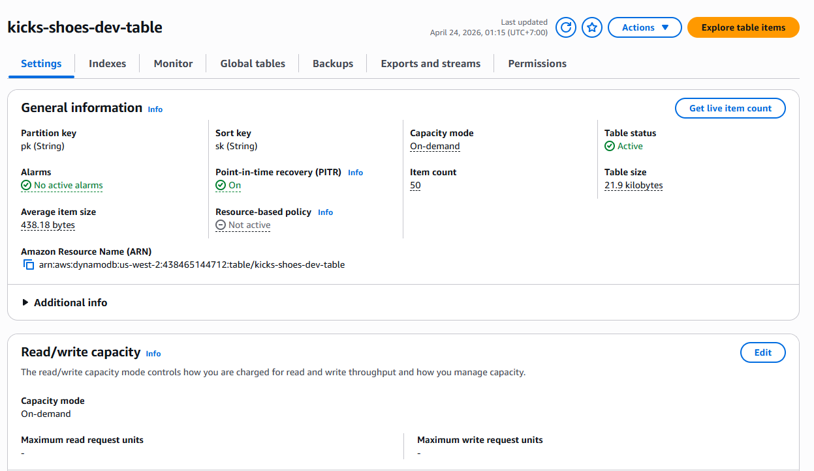

> _Note: Capacity mode được đặt ở chế độ **On-demand** để chịu tải linh hoạt theo nhu cầu thực tế của ứng dụng Kicks Shoes._

---

## 4. Working Query Evidence (DynamoDB)

### One Query by Partition Key

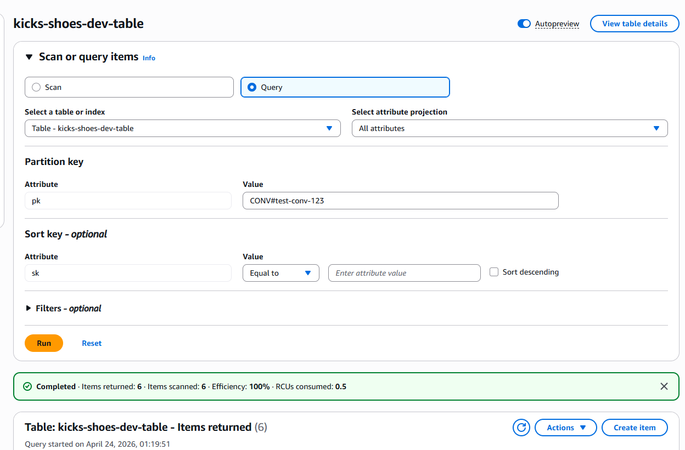

> _Note: Truy vấn lịch sử Chat của một User bằng hành động `Query`. Dữ liệu được trả về ngay lập tức dựa trên PK._

### One GSI Query

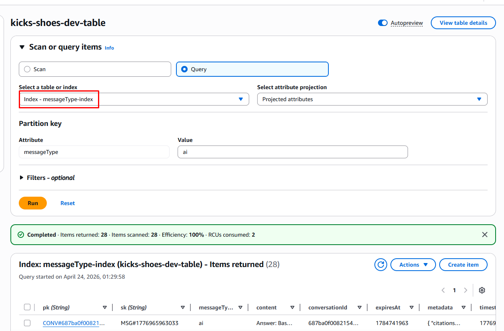

> _Note: Truy vấn thông qua Global Secondary Index (GSI) để lọc dữ liệu theo trạng thái tin nhắn mà không ảnh hưởng đến Partition Key chính._

---

## 5. Lambda + Bedrock Evidence

### Lambda IAM Role (No Wildcards)

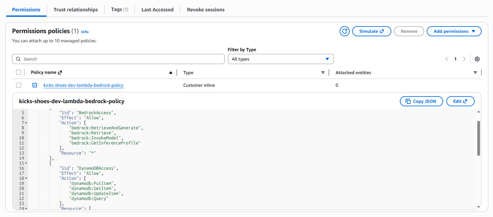

> _Note: Role `kicks-shoes-dev-lambda-bedrock-role` chỉ được cấp quyền đích danh tới Table ARN cụ thể. Tuân thủ nghiêm ngặt nguyên tắc Least Privilege._

```json
{
  "Version": "2012-10-17",
  "Statement": [
    {
      "Sid": "BedrockAccess",
      "Effect": "Allow",
      "Action": [
        "bedrock:RetrieveAndGenerate",
        "bedrock:Retrieve",
        "bedrock:InvokeModel",
        "bedrock:GetInferenceProfile"
      ],
      "Resource": "*"
    },
    {
      "Sid": "DynamoDBAccess",
      "Effect": "Allow",
      "Action": ["dynamodb:PutItem", "dynamodb:GetItem", "dynamodb:UpdateItem", "dynamodb:Query"],
      "Resource": [
        "arn:aws:dynamodb:us-west-2:438465144712:table/kicks-shoes-dev-table",
        "arn:aws:dynamodb:us-west-2:438465144712:table/kicks-shoes-dev-table/index/*"
      ]
    },
    {
      "Sid": "DynamoDBStreamAccess",
      "Effect": "Allow",
      "Action": [
        "dynamodb:DescribeStream",
        "dynamodb:GetRecords",
        "dynamodb:GetShardIterator",
        "dynamodb:ListStreams"
      ],
      "Resource": "arn:aws:dynamodb:us-west-2:438465144712:table/kicks-shoes-dev-table/stream/*"
    },
    {
      "Sid": "CloudWatchLogs",
      "Effect": "Allow",
      "Action": ["logs:CreateLogGroup", "logs:CreateLogStream", "logs:PutLogEvents"],
      "Resource": "arn:aws:logs:*:*:log-group:/aws/lambda/kicks-shoes-dev-*:*"
    }
  ]
}
```

### CloudWatch Logs & Bedrock Response

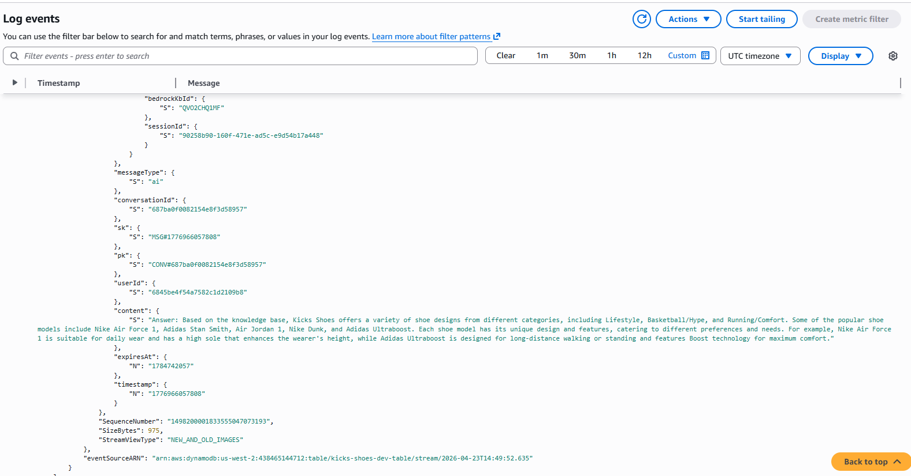

> _Note: Log hiển thị thời gian chính xác (Timestamp) và JSON response thành công từ Bedrock Knowledge Base khi được Lambda trigger._

---

## 6. VPC + Networking Evidence

### S3 / DynamoDB Gateway Endpoints

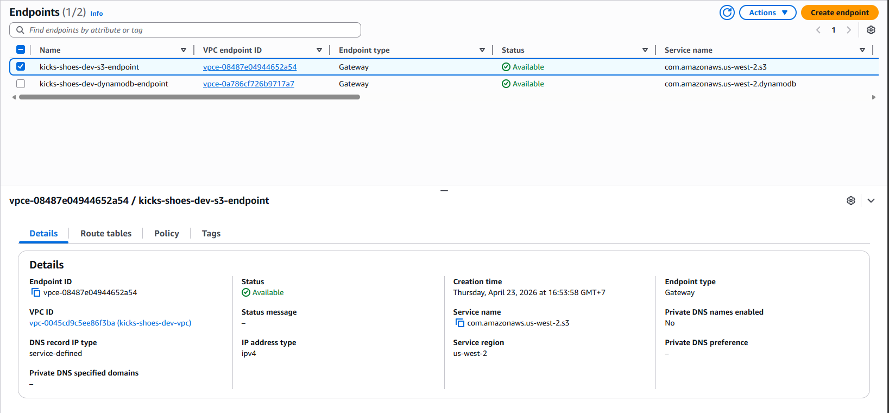

> _Note: Hệ thống triển khai cả 2 Gateway Endpoints cho S3 và DynamoDB để đảm bảo tính cô lập (Isolation) cho dữ liệu._

### Route Table Association

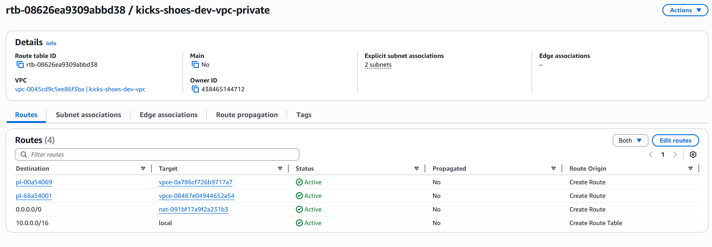

> _Note: Route Table của Private Subnet hiển thị `vpce-...` trỏ tới DynamoDB, xác nhận traffic được định tuyến an toàn._

---

## 7. Negative Security Test

### Unauthorized Access Denied

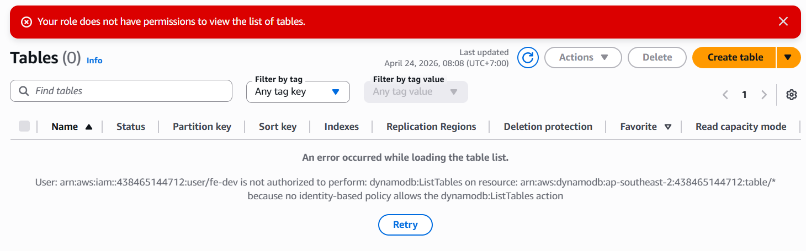

> _Note: Thử nghiệm truy cập từ Public Internet hoặc từ Role không có quyền, hệ thống trả về lỗi **AccessDeniedException** đúng như kỳ vọng._

---

## 8. Bonus: Ops Drill Scenario

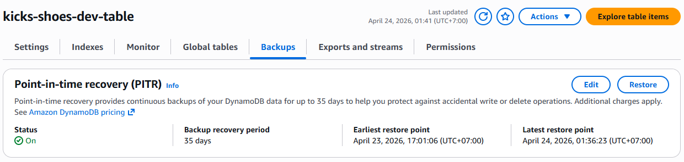

- **Scenario Chosen:** DynamoDB Point-in-Time Recovery (PITR).
- **Action:** Đã kích hoạt tính năng PITR để bảo vệ dữ liệu khỏi các thao tác xóa/sửa nhầm bằng cách cho phép khôi phục về bất kỳ thời điểm nào (giây) trong 35 ngày gần nhất.

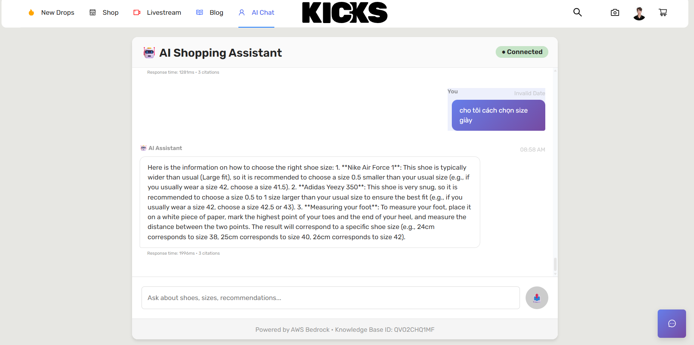

- Bonus: Bedrock Test UI
- **Scenario Chosen:** Bedrock Test UI.
- **Action:** Sử dụng giao diện Test UI của Bedrock để tương tác trực tiếp với Knowledge Base, kiểm tra khả năng truy xuất ngữ cảnh từ RAG.
